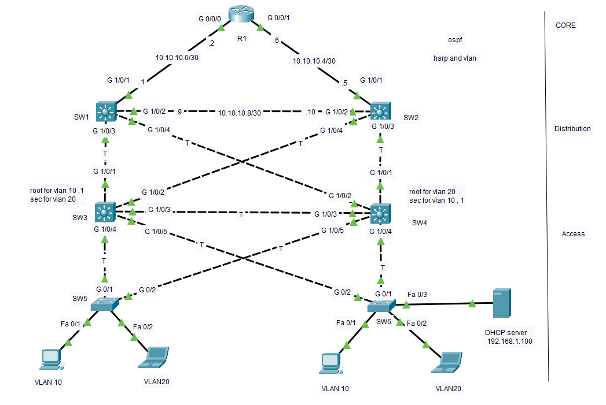
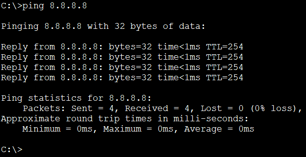
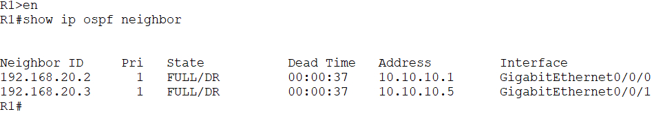
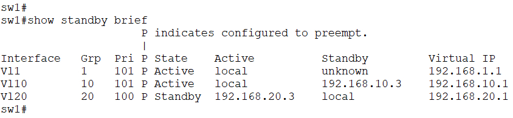
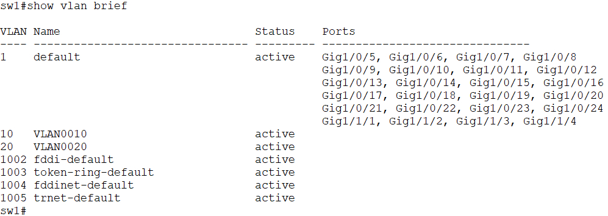
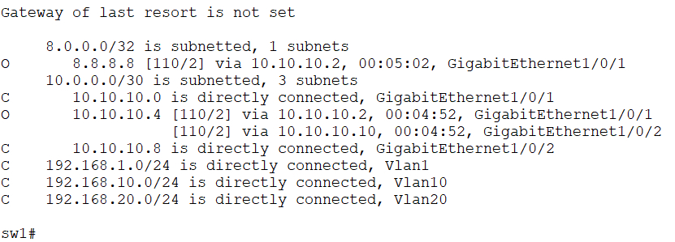

# Campus Network CCNA Lab

## Overview

This project is a Cisco Packet Tracer campus network built as a CCNA practice lab.

The goal was to combine multiple networking technologies into a single working topology while practicing configuration and troubleshooting.

---

## Technologies Used

- VLAN
- Trunking (802.1Q)
- VTP
- Rapid PVST+
- HSRP
- OSPF
- DHCP
- Inter-VLAN Routing
- Static Default Route

---

## Network Topology

#### ping test 

#### ospf neighbor 

#### HSRP 

#### Vlan

#### ip routes 

---

## Features

- VLAN 10 & 20
- VTP 
- HSRP Default Gateway Redundancy
- OSPF Dynamic Routing
- DHCP Address Assignment
- End-to-End Connectivity
- STP Root Bridge Configuration

## Files

- Packet Tracer topology (.pkt)
- Device configurations
- Verification screenshots